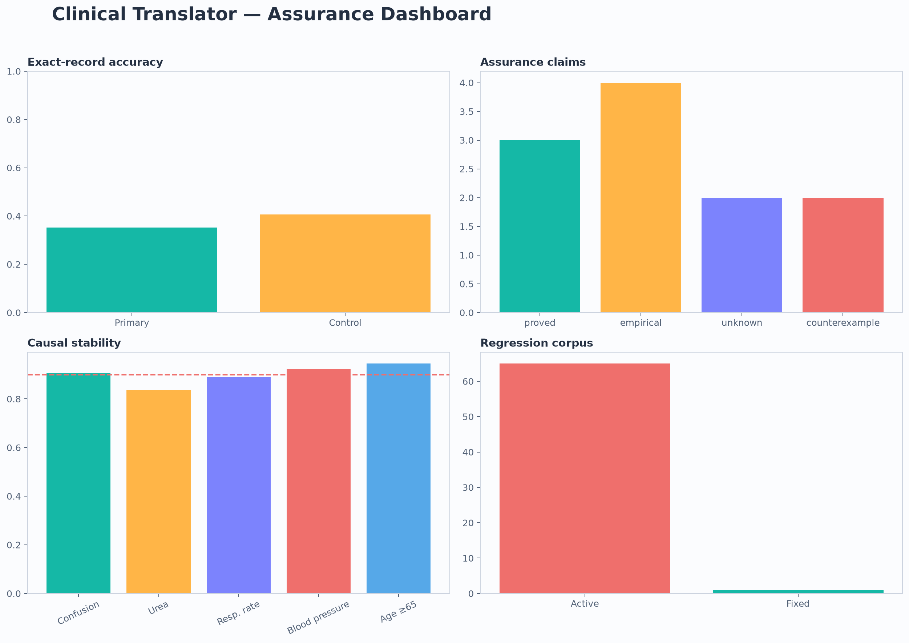

# Clinical Translator

Bounded, auditable translation of controlled clinical text into formally
verified CURB-65 facts.

> [!IMPORTANT]
> This is a research system for synthetic data. It does not diagnose, recommend
> treatment, process patient data, or establish clinical deployment safety.

[](artifacts/pngs/00_contact_sheet.png)

The project separates four kinds of result that are often blurred together:

- `proved`: a theorem or exhaustive finite-domain result;
- `empirical`: a measured model, feature, circuit, or intervention result;
- `counterexample`: a concrete failing case;
- `unknown`: a claim that available evidence cannot certify.

## What the system does

```text
controlled vignette
  → Llama translator
  → five Boolean CURB-65 facts
  → formally verified scorer
  → proof, bounded evidence, counterexample, or unknown
```

The neural translator never calculates the CURB-65 score. It emits exactly
five Boolean facts:

1. confusion;
2. urea greater than 7 mmol/L;
3. respiratory rate at least 30/min;
4. systolic pressure below 90 mmHg or diastolic pressure at most 60 mmHg;
5. age at least 65.

The deterministic downstream scorer sums those facts. Its correctness is
proved independently of model accuracy.

## Frozen scope

| Item | Value |
|---|---|
| Primary model | `m42-health/Llama3-Med42-8B` |
| Primary revision | `ceab7e7ee4b9dbde7ba82867f34274db51487d83` |
| Control model | `NousResearch/Meta-Llama-3-8B-Instruct` |
| Control revision | `53346005fb0ef11d3b6a83b12c895cca40156b6c` |
| Grammar | `curb65-vignette-grammar-v1` |
| Complete prompt set | 256 prompts: 32 logical combinations × 8 templates |
| Robustness set | 6 incomplete prompts |
| Counterfactual set | 640 matched pairs per model |
| Reference precision | BF16 |
| Patient data | None |

The content-addressed contract is
[`configs/contracts/curb65-llama-v2.json`](configs/contracts/curb65-llama-v2.json).

## Results

| Result | Primary | Control | Evidence type |
|---|---:|---:|---|
| Exact five-fact record accuracy | 35.16% | 40.62% | Empirical |
| Confusion accuracy | 83.59% | 100.00% | Empirical |
| Elevated-urea accuracy | 75.78% | 85.55% | Empirical |
| High-respiratory-rate accuracy | 98.44% | 94.92% | Empirical |
| Low-blood-pressure accuracy | 78.91% | 78.91% | Empirical |
| Age-at-least-65 accuracy | 73.44% | 68.36% | Empirical |
| Counterfactual consistency | 45.31% | 56.09% | Empirical |

Mechanistic results are bounded to the declared synthetic prompts and
teacher-forced fact-token decisions:

- held-out feature decodability ranges from 62.50% to 90.62%;
- candidate circuits retain 2–4 of 33 tested components per fact;
- keep-only circuit agreement ranges from 95.31% to 100%;
- eligible residual interventions move every tested fact token in the predicted
  direction;
- unrelated-output stability ranges from 83.59% to 94.53%, so all five neural
  variable alignments remain `mixed`.

The assurance manifest contains 11 claims: 3 `proved`, 4 `empirical`,
2 `counterexample`, and 2 `unknown`. The regression corpus contains 65 active
counterexamples and one fixed proof regression.

These measurements are not proof of unrestricted language equivalence,
whole-model verification, diagnosis or treatment safety, or deployment
readiness.

## Quick start

Python 3.12 and [uv](https://docs.astral.sh/uv/) are required.

```bash
uv sync --frozen
uv run python -m clinical_translator.contracts
uv run python -m clinical_translator.data
uv run python -m unittest discover -s tests -v
```

Score one validated five-fact record:

```bash
printf '%s' '{"confusion":true,"elevated_urea":true,"high_respiratory_rate":false,"low_blood_pressure":false,"age_at_least_65":true}' \
  | uv run python -m clinical_translator.assurance.oracle
```

The expected score is `3`.

## Reproduce the assurance package

The formal and packaging stages run locally:

```bash
uv run python -m clinical_translator.assurance.symbolic
uv run python -m clinical_translator.assurance.proof_engine
uv run python -m clinical_translator.assurance.counterexamples
uv run python -m clinical_translator.assurance.counterexamples --demo
uv run python -m clinical_translator.assurance.manifest
uv run python -m unittest discover -s tests -v
```

After installing Elan, Lean can also be checked directly:

```bash
$HOME/.elan/bin/lean proofs/ClinicalTranslator/CURB65.lean
```

## Run the model pipeline

Model weights and BF16 activations stay on Modal volumes. Never commit weights
or Hugging Face credentials.

```bash
export HF_TOKEN="your-token"
uv run --with modal==1.5.3 modal setup
uv run --with modal==1.5.3 modal secret create huggingface HF_TOKEN="$HF_TOKEN"

# Verify gated-model access, then cache both pinned revisions.
uv run --with modal==1.5.3 modal run -m clinical_translator.models.modal_app
uv run --with modal==1.5.3 modal run -m clinical_translator.models.modal_app --download

# Run the bounded experiment stages.
uv run --with modal==1.5.3 modal run -m clinical_translator.models.modal_app --smoke
uv run --with modal==1.5.3 modal run -m clinical_translator.models.modal_app --evaluate-all
uv run --with modal==1.5.3 modal run -m clinical_translator.models.modal_app --capture
uv run --with modal==1.5.3 modal run -m clinical_translator.models.modal_app --discover-features
uv run --with modal==1.5.3 modal run -m clinical_translator.models.modal_app --extract-circuits
uv run --with modal==1.5.3 modal run -m clinical_translator.models.modal_app --validate-causality
```

The Modal app creates its model and activation volumes when needed. Gated model
access must already be accepted on Hugging Face.

## Evidence and artifacts

| Artifact | Purpose |
|---|---|
| [`artifacts/pngs/00_contact_sheet.png`](artifacts/pngs/00_contact_sheet.png) | Index of all 32 result visualizations |
| [`evidence/goal-05/metrics.json`](evidence/goal-05/metrics.json) | Complete behavioral metrics |
| [`evidence/goal-07/report.json`](evidence/goal-07/report.json) | Feature discovery and reconstruction |
| [`evidence/goal-08/report.json`](evidence/goal-08/report.json) | Candidate circuits and ablations |
| [`evidence/goal-09/report.json`](evidence/goal-09/report.json) | Causal interventions and controls |
| [`evidence/goal-11/certificate.json`](evidence/goal-11/certificate.json) | Proof and coverage certificate |
| [`evidence/goal-12/regressions.jsonl`](evidence/goal-12/regressions.jsonl) | Counterexample regression corpus |
| [`evidence/goal-13/assurance-manifest-v1.yaml`](evidence/goal-13/assurance-manifest-v1.yaml) | Versioned claims, hashes, limits, and reproduction commands |
| [`evidence/goal-13/benchmark.json`](evidence/goal-13/benchmark.json) | Compact cross-stage benchmark |
| [`evidence/goal-13/technical-report.txt`](evidence/goal-13/technical-report.txt) | Plain-text technical report |
| [`notebooks/assurance-audit.ipynb`](notebooks/assurance-audit.ipynb) | Reproducible assurance audit |

All 33 PNGs are in [`artifacts/pngs/`](artifacts/pngs/). Raw generated
vignettes, activations, checkpoints, and model weights remain ignored.

## Repository layout

```text
artifacts/pngs/                  Tracked result visualizations
configs/contracts/              Frozen model and task contract
evidence/                       Versioned outputs for Goals 04–13
notebooks/                      Reproducible assurance audit
proofs/ClinicalTranslator/      Lean specification and theorem
src/clinical_translator/
├── contracts/                  Scope and schema validation
├── data/                       Finite synthetic vignette generator
├── models/                     Llama protocol and Modal runner
├── evaluation/                 Behavioral evaluation
├── interpretability/           Activations, features, circuits, causality
└── assurance/                  Oracle, mechanism, proofs, failures, manifest
tests/                          Thirteen end-to-end acceptance checks
```

## Claim boundary

Supported results apply only to the pinned models, frozen revisions, controlled
grammar, declared prompts, structured Boolean outputs, and recorded
interventions. See the assurance manifest before reusing any number or claim
outside that boundary.
